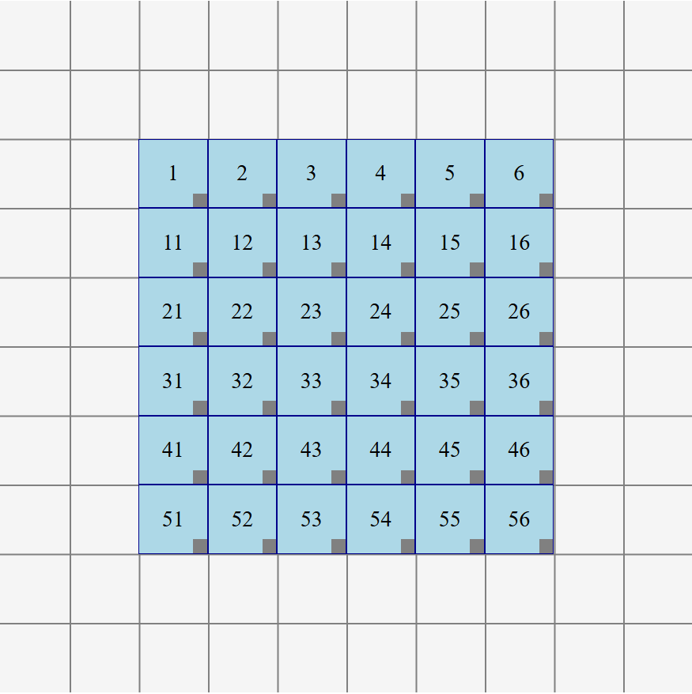
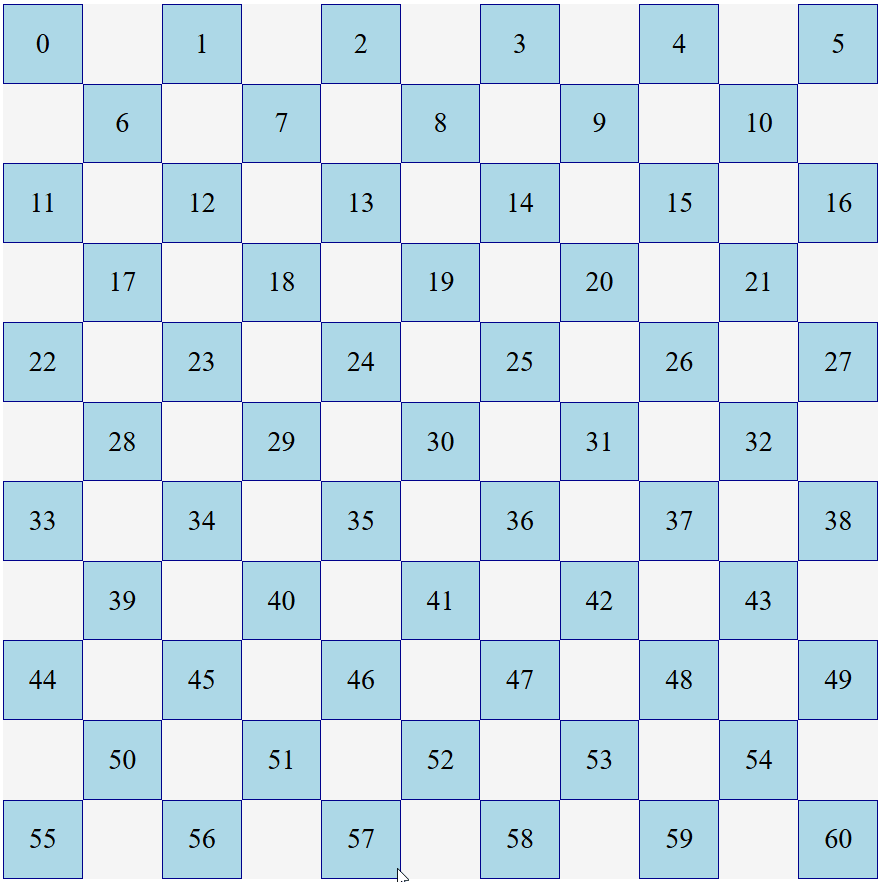

# Vue CSS Grid Layout
A grid layout for Vue.js using CSS Grid. Developed for use in the [AAC application AsTeRICS Grid](https://github.com/asterics/AsTeRICS-Grid).

<div align="center" width="100%">
    
    
</div>

## Use via npm in SFC
To use this library via npm and with Vue's Single-File Components (SFC), follow these steps:

First install via `npm install vue-css-grid-layout --save` or `yarn add vue-css-grid-layout`

Create a custom component for rendering a single grid element like this, e.g. as `render-component.vue`:
```vue
<template>
    <div class="render-component">{{ element.id }}</div>
</template>

<script>
export default {
    props: {
        element: Object
    }
}
</script>

<style scoped>
.render-component {
    border: 1px solid black;
    display: flex;
    flex-grow: 1;
}
</style>
```

Use `GridLayout` from this library in order to render a grid:
```vue
<template>
    <grid-layout :elements="elements" :render-component="RenderComponent"/>
</template>

<script>
import { GridLayout } from 'vue-css-grid-layout';
import RenderComponent from './render-component.vue';

export default {
    components: { GridLayout, RenderComponent},
    data() {
        return {
            RenderComponent: RenderComponent,
            elements: [
                { x: 0, y: 0, width: 1, height: 1, id: 1 },
                { x: 1, y: 1, width: 1, height: 1, id: 2 }
            ]
        }
    }
}
</script>

<style src="vue-css-grid-layout/dist/vue-css-grid-layout.css"></style>
```

## Use from CDN
To directly use this library in your project, you can just import the file from CDN (or use the files from the `dist` folder of this repository).

Include the CSS: 
```html
<link rel="stylesheet" href="https://unpkg.com/vue-css-grid-layout/dist/vue-css-grid-layout.css">
```

Create some HTML using the `grid-layout` element`:
```html
<div id="app">
    <grid-layout :elements="elements" render-component="render-component"/>
</div>
```

Import the `GridLayout` class in a script and use it:
```html
<script type="module">
    import { GridLayout } from 'https://unpkg.com/vue-css-grid-layout/dist/vue-css-grid-layout.es.js';

    Vue.component('render-component', {
        template: '<div class="render-component">{{ element.id }}</div>',
        props: {
            element: Object
        }
    });

    new Vue({
        el: '#app',
        components: { GridLayout },
        data() {
            return {
                elements: [
                    { x: 0, y: 0, width: 1, height: 1, id: 1 },
                    { x: 1, y: 1, width: 1, height: 1, id: 2 }
                ]
            };
        }
    });
</script>
```

## API
There are two components that can be used:
* `GridLayout`: the Vue component rendering a grid using CSS Grid
* `gridLayoutUtil`: a collection of utils for actions on the grid elements, e.g. collision handling or moving multiple elements. This component is used internally by `GridLayout`, but can also be used externally for manual collision handling or moving of multiple elements.

### GridLayout
The `GridLayout` Vue component has the following props and events.

#### Props
* `renderComponent: [Object, String]`: a Vue component that renders a single element of the grid. A prop `element` is passed to this component containing the data of the current element to render.
* `elements: Array`: an array of elements to render in the grid. Every element must have the properties `id, x, y, width, height` where the `id` must be unique. The single elements are passed to `renderComponent` as prop `element`.
* `rows: Number`: the minimum number of rows of the grid. Actual shown rows are the maximum of `rows` and `rows defined by given elements`.
* `columns: Number`: the minimum number of columns of the grid. Actual shown columns are the maximum of `columns` and `columns defined by given elements`.
* `backgroundColor: String`: the background color of the grid in any format valid in CSS (e.g. `lightblue` or `#f5f5f5`).
* `baseTag: String`: the name of the HTML tag the base element of the grid should have, e.g. `div`, defaults to an ordered list (`ol`).
* `elementTag: String`: the name of the HTML tag the grid elements should have, e.g. `div`, defaults to a list item (`li`). 
* `editable: Boolean`: if `true` the grid can be edited, elements can be dragged and resized.
* `resizeHandleSelector: String`: a CSS selector for selecting resize handles (at the bottom right) of the elements which make it clearer / easier to resize elements. Resize handles have to be added to the `renderComponent`, if desired.
* `backgroundLines: Boolean`: if `true` the grid shows lines in the background indicating the rows and columns of the grid
* `animationDurationMs: Number`: the duration of the animations when elements are dragged / resized (`editable: true`), defaults to `200ms`.

Any additional props can be passed to `GridLayout` which are passed on to the `renderComponent`. So e.g. if passing some generic options to `grid-layout` like this:
```html
<grid-layout :elements="elements" render-component="render-component" :generic-options="{ color: 'green' }"/>
```
These options can be used within the `render-component` along with the `element` passed by default:
```javascript
props: {
    element: Object, 
    genericOptions: Object
}
```

## Events
Two events can be emitted by `GridLayout` with `editable: true`:
* `changed (newElements)`: the event `changed` is emitted after the layout has changed by dragging or resizing. In the handler the rendered elements should be set to the new elements like `this.elements = newElements`.
* `interacted (x,y)`: the event `interacted` is emitted after a click or tap anywhere on the grid returning the coordinates of this event. This makes it easily possible to create new elements at the position of the last user interaction.

### gridLayoutUtil
The component `gridLayoutUtil` can be used for manually doing actions on the grid elements like moving all elements or resolving conflicts.

Import it along with `GridLayout`, if needed:
```javascript
import { GridLayout, gridLayoutUtil } from 'vue-css-grid-layout';
// or
import { GridLayout, gridLayoutUtil } from 'https://unpkg.com/vue-css-grid-layout/dist/vue-css-grid-layout.es.js';
```

These are the most important methods, for more details look at the [JSDoc comments in the implementation](https://github.com/asterics/vue-css-grid-layout/blob/main/src/utils/gridLayoutUtil.js):
* `gridLayoutUtil.moveAsPossible = function(allElements = [], moveElements = [], direction, options = {})`
   *  moves elements in a specific direction as far as possible (without colliding with another element)
   * `allElements`: array of all elements
   * `moveElements`: the elements to move
   * `direction`: the direction to move, see gridLayoutUtil.DIR_* or 1-4 (UP, RIGHT, DOWN, RIGHT)
   * `options.gridWidth` standard width of the grid, can be overruled by given grid elements
   * `options.gridHeight` standard height of the grid, can be overruled by given grid elements
* `gridLayoutUtil.resolveCollisions = function(gridElements, newElement, options = {})`
   * resolves collisions based on given grid and a newly added / changed element
   * `gridElements` array of all grid elements (including newElement)
   * `newElement` element changed / added (already at new position)

## Acknowledgement
This library was initially developed within a [netidee project funding](https://www.netidee.at/asterics-grid).

<a href="https://www.netidee.at/asterics-grid">

</a>